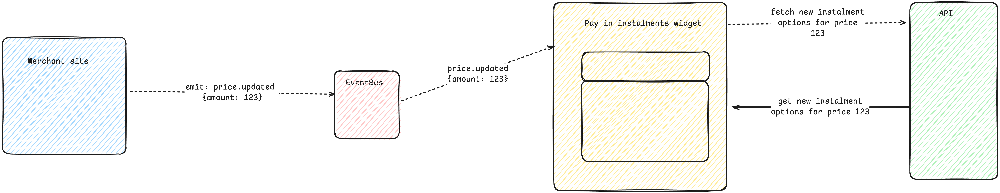
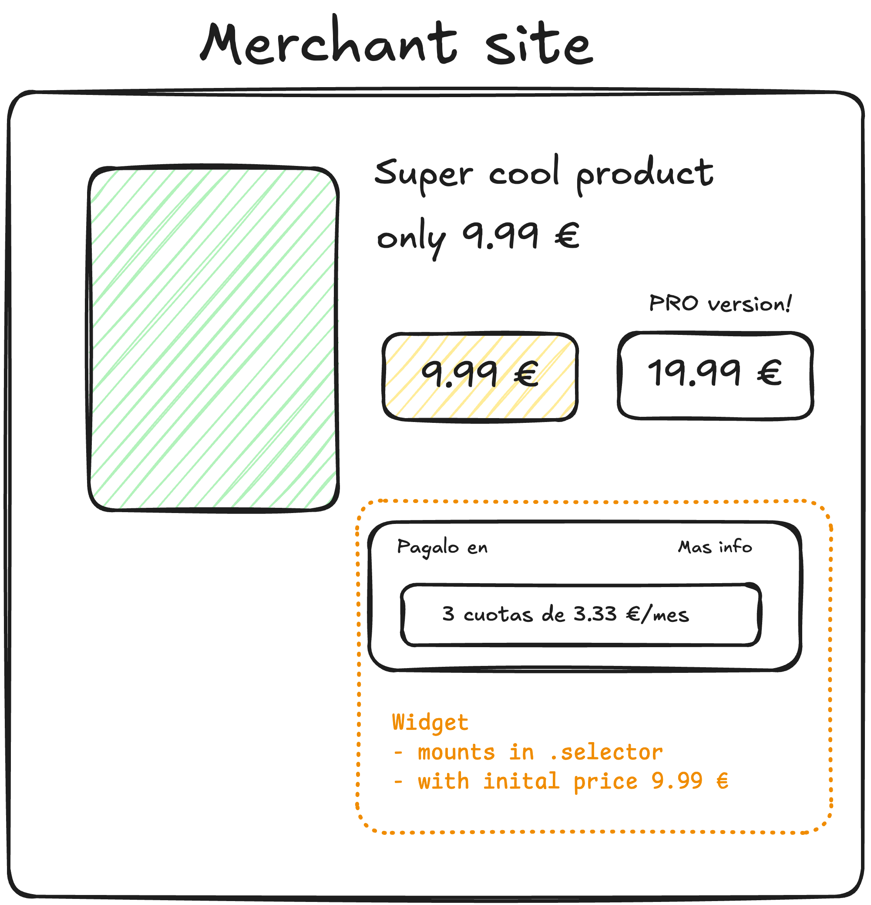
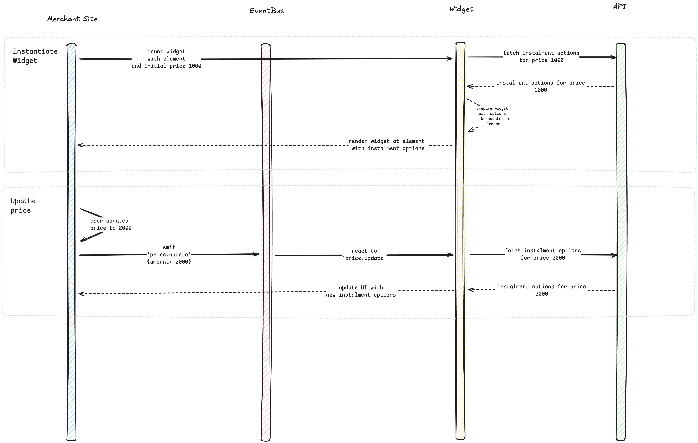

# Solution to the challenge log ✍️

## Brainstorming and Analysis

Having taken a look at the challenge's [read me doc](README.md), I started by brainstorming what the end product would look like.

Two statements stood out to me when reading it:

> "...the Product Designer from the team has made a wireframe and now is asking you to implement a widget to display the instalments options for a given product, on a merchant page"

> "Integrate the prototype in the merchant sample site (`merchant-site/product-page.html`) so that every time the product price changes the financing value is updated."

Given that the challenge as _seQura_ does in real life, should integrate with various merchants, the first thing that comes to my mind is that this widget should be as easy to integrate as possible regardless of the platform/framework that it is used in. As the example demonstrates - it should behave the same in an HTML site with JQuery as it would with a Shopify website.

### MVP of the widget

Having this into consideration, I wanted to start by design what **I would expect** the end API would look like from a merchant's perspective:

I would like to have a script that I could deploy on a CDN (or any other system) so that a merchant could install it in the <head> tag of their website.

```html
<script src="/path/to/widget/pay-in-instalments-widget.js"></script>
```

Ideally this widget should be as easy to set up as possible - ideally it should only require a `place` to be rendered in.

```html
<script>
  const widgetContainer = document.querySelector(".widget-container"); // This node is up to the merchant website to decide
  const payInInstalmentWidgetInstance = new PayInInstalmentsWidget();
  payInInstalmentWidgetInstance.mount(widgetContainer);
</script>
```

This is what I would tackle as an MVP of this first widget. We could always extend this through a configuration passed to the class constructor, like behaviour, style, and even apiKey validation (same as for instance google maps widget works). These I believe for the scope of this challenge can be left out, but definitely taken into account moving forward with this.

```html
<script>
  const widgetContainer = document.querySelector(".widget-container"); // This node is up to the merchant website to decide
  const payInInstalmentWidgetInstance = new PayInInstalmentsWidget({
    apiKey: "super_secret_client_key", // validate against a backend that ensures the API KEY is correct
  });
  payInInstalmentWidgetInstance.mount(widgetContainer);
</script>
```

Another important point, is that a merchant needs to be able to update the widget so that it displays correctly the price and the amount of financing and financing plans that are offered for that product. For that, I believe could have an API within the widget that subscribes to events and emits events, in order to update not only the UI, but the correct financing plan

```html
<script>
  //... Init widget ...
  // Somewhere else

  $(".product-capacity").on("click", function () {
    // UI logic
    widgetContainer.emit("update-price", { value: amount });
  });
</script>
```

This should trigger an update within the widget, and call the Service responsible for the credit information, for instance: `/credit_agreements?totalWithTax={amount}`

### Styling

I believe styling is a big part of the widget's functionality, as we should aim for it being customizable (within certain parameters) and ship with barebones styles by default.

For instance, the merchant website should be able to easily customize all the components and subcomponents

```html
<style>
  .pay-in-instalments-widget__listbox {
    // Override default styles
  }

  .pay-in-instalments-widget__listbox__selected-item {
    // Override default styles
  }
</style>
```

## Implementation

```sh
pnpm create vite@latest pay-in-instalments-widget --template react-ts
```

I decided to init a new a new package called `pay-in-instalments-widget`. This package should be agnostic to any merchant, and should expose a simple API as explained above in the [Brainstorming and Analysis](#brainstorming-and-analysis) section

I have taken some considerations into account - both regarding the challenge itself and some that I would discuss with the _development_ and _product team_. The tech stack that I have chosen is the following:

**React**

- Pros:
  - Vast ecosystem
  - Growing industry standard
  - Scalability in terms of functionality
  - Composability
- Cons:
  - Bundle size (given that we're shipping our widget _along_ with react itself, this adds to the bundle size)

> (This is something that I would debate with product team, as I would like to understand if bundle size is a key aspect of the widget)

**Vite**

- Pros:
  - Easily quickstart a new web-app or web-lib (our case)
  - Plugin ecosystem (tailwind, react)
  - Rollup integrated

**Typescript**

- Pros:
  - TypeSafe layer helps us minimize unit tests and bugs
  - Improvements in developer experience
- Cons:
  - Setup
  - Maintenance

> (This is something that I would debate with the dev team)

** Vanilla CSS **

- Pros:
  - Straight forward implementation of css, along with BEM naming conventions
  - Having classnames that could be modified from the merchant's web/web-app.
- Cons:
  - Not as fast as a utility-based solution like tailwind-css

Technologies that I considered, but I will not be using for the challenge:

- **Tailwindcss**:

  - I would have used tailwindcss if this widget shouldn't be as _customizable_, as an assumption I believe every merchant site should be able to configure (within some restrictions) the way the widget looks like
  - Also, we should keep in mind the bundle size that tailwind adds if not tree-shaken

- **Axios**

  - I like having a TypeSafe API layer in order to interact with external services, however for the scope of the project I believe we could achieve the same with a minimal wrapper around the native `fetch`

- **@tanstack/react-query**

  - Revalidating and maintaining the information up-to-date with our server is crucial, specially in dynamic web-apps. I believe that @tanstack/react-query would be a great add-on to our architecture, but I believe for this challenge we could achieve something close with a smaller vanilla implementation of a _refetch_ system that triggers every time an _event_ is fired. Also - this pairs up well with a _PubSub/EventBus_ system.

- **headless ui**
  - While I do believe that headless helps ups as much as having a component library - I believe that it also has a trade-of in bundle size, and in flexibility. Given that the scope of the widget is for it to be customizable, I have decided to own the implementation of each of the components

### Overview of the functionality

The following is a high-level diagram of the architecture I have implemented


The `widget` instance has access to the `EventBus` through the `events` method. It can subscribe and emit events. This way, every merchant site, can integrate easily with our widget.

The `EventBus` is the one in charge of detecting wether we need to fetch new data from the API if the price changes (increase or decrease)

For example, lets take the following page:



In this case, the merchant site has instantiated the widget with an `element` and an starting `price`

In case the user decides to update the price, then the flow would look like this:



Let's break down these two use cases:

1. Instantiating the Widget:

- The merchant site mounts the widget in a specific element with an initial price of 1000.
- The widget communicates with the API to fetch installment options for the price 1000.
- The API returns installment options for the given price.
- The widget renders itself in the specified element with the received installment options.

2. Updating the Price:

- The user updates the price to 2000.
- The merchant site emits a `price.update` event through the EventBus, with the new amount { amount: 2000 }.
- The widget listens to this event and reacts by:
  - Fetching new installment options from the API for price 2000.
  - Receiving the updated installment options from the API.

### Testing strategy

I have implemented critical e2e testing and integration tests. The e2e tests were done with `playwright` and they test a browser, with the widget mounting to an element, as it would in a merchant website

I have used `vitest` along with `jsdom`, `msw` and `react-testing-library` in order to test our core business logic, as well as other components.

### Implementation of the widget

I have duplicated the original merchant site, and implemented our widget inside of the website.
As we can se, when we change from the Iphone capacity, it notifies the widget through our EventBus, and we get the new instalment options.

You can [find the website with the widget implemented here](./merchant-site-with-widget/)

### Final thoughts

This has been an awesome challenge, in the sense that I have learned a lot from thinking about the implementation beforehand and then tackling it from a technical perspective. I have also gained more insights about how widgets systems would work in 3rd party websites

### Future improvements

These are things that I am aware should be implemented by having a long term vision of the product

#### Translations

As an assumption, this widget will operate on various merchants. These merchants could be anywhere in the world, and they should be able to customize the language they want the widget to use. This is one of the options that I believe we could add to the initial `config` of the widget. For instance:

```html
const widget = new PayInInstalmentsWidget({ locale: 'ca-ES' })
```

We could even emit and subscribe to changes in language

```html
widget.events.emit('update.locale','es-ES')
```

#### Design tokens

We could replace the current hardcoded styles with design tokens from our brand, so that by default it ships with the seQura look and feel.

For instance:

```css
.pay-in-instalments-widget__more-info-dialog__content {
  background: var(--primary-color);
  border-radius: var(--border-radius-md);
}
```

#### Ship as an SDK

In case we are shipping our solution to a broader ecosystem, (not react specific) - It would be a great addition to ship our `Types`

I would have considered using [vite-plugin-dts](https://www.npmjs.com/package/vite-plugin-dts) which allows us to ship not only our `js` and `css` files but also our type definitions.

Defining it should be as straight forward as adding it to our vite.config.ts file

```ts
export default defineConfig({
  plugins: [
    // ...
    dtsPlugin({
      entryRoot: "src",
      outDir: "dist/types",
      insertTypesEntry: true,
      tsconfigPath: "./tsconfig.app.json",
    }),
  ],
});
```

This way, we are providing a better DX for customers that use our widget with their web-based solutions.
